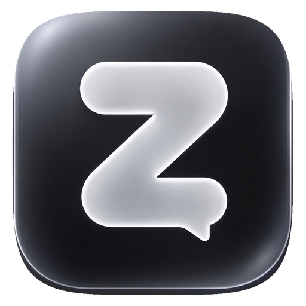

#  Zvon

**Zvon** — это современная и высокопроизводительная коммуникационная платформа реального времени, вдохновленная Discord, но с упором на премиальный дизайн и расширенные возможности аудио-захвата.

[](https://github.com/pkda1lu/zvon/releases)
[](https://www.electronjs.org/)
[](https://socket.io/)

---

## ✨ Ключевые особенности

### 💬 Сообщения и Серверы
- **Real-time Messaging**: Мгновенный обмен сообщениями через WebSockets.
- **Гибкая структура**: Серверы, категории, текстовые и голосовые каналы.
- **Двухфакторная аутентификация (2FA)**: Защита аккаунта по Email.
- **Система ролей**: Гибкие уровни доступа.
- **Значки профиля**: Коллекционные бейджи (Dev, Premium, Gamer и др.).

### 🎙️ Голос и Видео
- **Voice Channels**: Кристально чистый звук с встроенным подавлением шума.
- **Screen Sharing**: Демонстрация экрана с **захватом системного аудио** (через нативный модуль C++).
- **WebRTC**: Надежные прямые соединения для минимальной задержки.

### 💻 Desktop Experience
- **Auto-Updater**: Профессиональное окно обновления с уникальной анимацией.
- **Deep Linking**: Поддержка протокола `zvon://` для открытия инвайтов прямо в приложении.
- **Tray & Notifications**: Полная интеграция с системным треем и уведомлениями Windows.

### 🎨 Премиальный UI и Экосистема
- **Liquid Glass Design**: Премиальный интерфейс с эффектами размытия и анимациями.
- **Mini-Apps & Bots**: Платформа для интеграции сторонних веб-приложений и чат-ботов прямо в интерфейс.
- **Landing Page**: Современная стартовая страница с 3D-графикой.
- **Documentation**: Раздел для разработчиков с описанием Bot API.
- **Dark Mode**: Фирменная темная тема.

---

## 🧩 Мини-приложения (Mini-Apps)

Zvon поддерживает запуск внешних веб-приложений в виде плавающих окон внутри интерфейса. Это позволяет пользователям играть в игры, использовать утилиты или смотреть контент, не прерывая общение.

### 📝 Требования к разработке
При создании мини-приложения для Zvon необходимо учитывать следующие технические особенности:

1. **CSP и X-Frame-Options**: 
   > ⚠️ **ВАЖНО:** Сайт, на котором размещено ваше мини-приложение, **НЕ ДОЛЖЕН** блокировать возможность встраивания через `iframe`. Убедитесь, что заголовки `X-Frame-Options` не установлены в `DENY` или `SAMEORIGIN` (если домены различаются), а политика `Content-Security-Policy` (директива `frame-ancestors`) разрешает встраивание на доменах Zvon.

2. **Адаптивность**: Приложение должно корректно отображаться в небольших плавающих окнах с возможностью изменения размера.
3. **Безопасность**: Используйте только HTTPS-протокол для работы ваших приложений.

---

## 🚀 Стек технологий

| Модуль | Технологии |
| :--- | :--- |
| **Frontend** | React, TypeScript, Vite, Vanilla CSS, WebRTC |
| **Backend** | Node.js, Express, MongoDB (Mongoose), JWT |
| **Real-time** | Socket.io |
| **Desktop** | Electron, C++ (Native Audio Module) |
| **Инфраструктура** | PM2, Nginx, Let's Encrypt |

---

## 🛠️ Быстрый старт

### Требования
- Node.js 18+
- MongoDB 6.0+
- Git

### Установка

1. **Клонируйте репозиторий:**
   ```bash
   git clone https://github.com/pkda1lu/zvon.git
   cd zvon
   ```

2. **Настройка сервера:**
   ```bash
   cd server
   npm install
   cp .env.example .env # Настройте PORT, MONGODB_URI и JWT_SECRET
   npm run dev
   ```

3. **Настройка клиента (Браузерная версия):**
   ```bash
   cd client
   npm install
   npm run dev
   ```

4. **Запуск десктопной версии (Electron):**
   ```bash
   cd client
   npm run electron:dev
   ```

---

## 📦 Сборка и Деплой

### Сборка Windows приложения
```bash
cd client
npm run electron:build
```
Инсталлер будет доступен в папке `client/dist`.

### Деплой на VPS
Подробная инструкция по деплою (Nginx, PM2, SSL) находится в файле [VPS_DEPLOYMENT.md](./VPS_DEPLOYMENT.md).

---

## 📂 Структура проекта

```text
zvon/
├── client/           # React + Electron (Frontend)
│   ├── src/          # Исходный код UI
│   ├── public/       # Статические ресурсы и Electron точки входа
│   └── native-audio/ # C++ модуль захвата аудио
├── server/           # Node.js + Express (Backend)
│   ├── models/       # Схемы данных MongoDB
│   ├── routes/       # API Эндпоинты
│   └── uploads/      # Хранилище пользовательских файлов
└── sounds/           # Системные звуки приложения
```

---

## 📄 Лицензия

Проект распространяется под лицензией ISC. Разработано с страстью к качественной связи.

**Автор:** [pkda1lu](https://github.com/pkda1lu)
